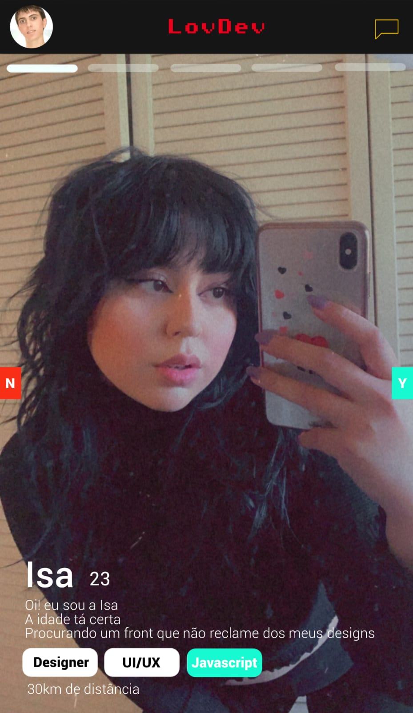

# Projeto LovDev:heart:

LovDev é um app de encontros para desenvolvedores, feito inicialmente em C# e Xamarin, mas com a pretensão de ser extendido a outras linguagens/frameworks.  
  
  

## Contribuidores

Design do app feito por: [Yuno](https://twitter.com/yunoonie "Yuno")  

Xamarin: [João Vitor](https://twitter.com/joaovjo "João Vitor")

